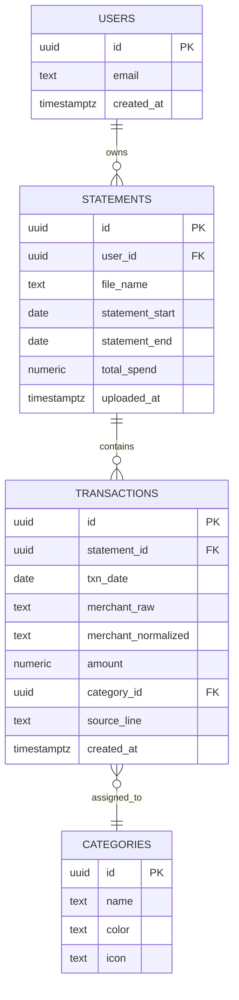
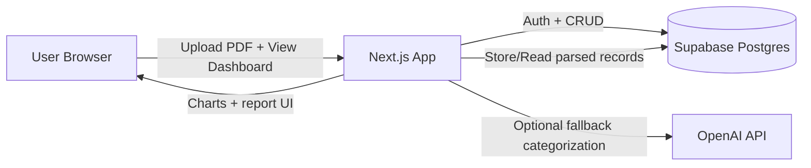

# Statement Spending Analyzer (MVP)

Privacy-first web app for uploading monthly statement PDFs from supported banks, extracting transactions, categorizing spending, and showing a monthly report dashboard.

## Tech Stack

- Next.js 16 (App Router) + TypeScript + Tailwind CSS
- Supabase (PostgreSQL + Auth + RLS)
- Recharts (ready to connect in dashboard expansion)
- OpenAI (planned fallback categorization + monthly summary)

## Current MVP Scope

- Email magic-link auth via Supabase
- Single ingestion endpoint: `POST /api/ingest`
- Multi-bank ingestion with Chase and UCCU parser support
- Transaction normalization + AI-based categorization
- Statement list page and statement detail page (summary cards + table)
- SQL migrations for schema + RLS policies

## Environment Variables

Copy `.env.example` to `.env.local` and fill in:

```bash
NEXT_PUBLIC_SUPABASE_URL=
NEXT_PUBLIC_SUPABASE_ANON_KEY=
OPENAI_API_KEY=
```

## Run Locally

```bash
npm install
npm run dev
```

## Important Files

- `supabase/migrations/0001_init.sql`: core schema
- `supabase/migrations/0002_rls.sql`: RLS policies
- `src/app/api/ingest/route.ts`: single ingestion flow
- `src/lib/parsing/chaseUsParser.ts`: Chase credit-card parser
- `src/lib/parsing/uccuParser.ts`: UCCU checking parser
- `src/lib/parsing/banks.ts`: supported bank labels and ids
- `src/lib/parsing/parserRegistry.ts`: supported bank registry
- `src/lib/parsing/normalizeTransactions.ts`: normalization utilities
- `src/lib/categorization/ai.ts`: AI transaction categorization
- `src/app/(app)/statements/new/page.tsx`: upload page
- `src/app/(app)/statements/[id]/page.tsx`: statement detail page

## Project Purpose and Goals (for Classmates)

### What this project does

`Statement Spending Analyzer` is a privacy-first web app that helps users understand monthly credit card spending from a single PDF statement upload.

### Why this matters

- Many people receive statement PDFs but do not easily see where money is actually going.
- Existing finance tools can feel heavy or require linking bank accounts.
- This MVP focuses on a simple upload flow + clear monthly insights.

### Core goals (MVP)

- Upload a supported statement PDF and choose the matching bank format
- Parse transactions and normalize merchant/date/amount
- Categorize spending with initial rule-based logic
- Show category totals and transaction-level detail on a dashboard

### Simple feature flow

1. User signs in (magic link)
2. User uploads monthly statement PDF
3. Server parses and stores transactions
4. App displays category spending summary and detailed table

## Initial ERD (Data Sketch)



## Rough System Design Diagram



- Tech blocks: Next.js, Supabase, OpenAI (optional fallback), Recharts UI
- Arrows: request/response and data flow between client, app server, and storage

## Initial Daily Goals (Now -> End of Class)

- **Day 1**: finalize schema, auth, and PDF upload API contract
- **Day 2**: complete parser coverage and robust normalization
- **Day 3**: improve categorization rules and handle edge cases
- **Day 4**: finish dashboard visuals (totals, category chart, transaction table)
- **Day 5**: polish UX, seed demo data, and run end-to-end test
- **Day 6**: bug fixing, documentation cleanup, and class demo prep

## Optional Rough UX Sketches

Below is a low-fidelity text sketch (replace with hand-drawn image if preferred):

```text
[Login]
  - email input
  - magic link button

[Upload Statement Page]
  - drag & drop PDF
  - upload button
  - latest uploads list

[Monthly Dashboard]
  - total spend card
  - top categories chart
  - transaction table (date / merchant / amount / category)
```

If you want, add real sketch images here:

- `docs/ux/login-sketch.png`
- `docs/ux/upload-sketch.png`
- `docs/ux/dashboard-sketch.png`
