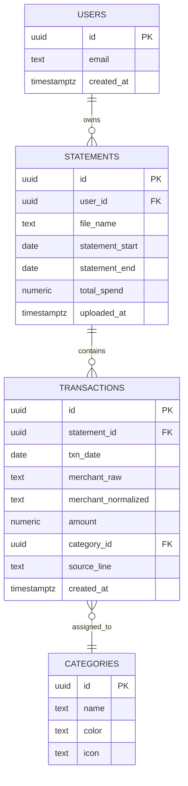
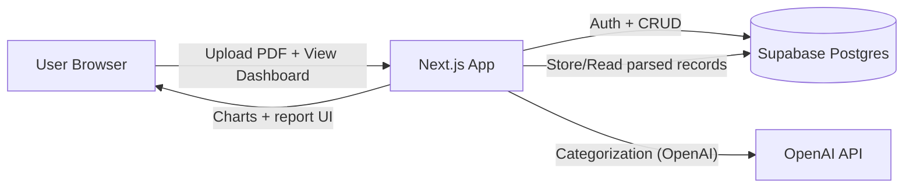

# Statement Spending Analyzer (MVP)

Privacy-first web app for uploading monthly statement PDFs from supported banks, extracting transactions, categorizing spending, and showing a monthly report dashboard.

**Repository:** [github.com/jhwlds/2026-project](https://github.com/jhwlds/2026-project)

---

## Final report

### Project summary

This project is a privacy-oriented web application that ingests bank statement PDFs, parses transactions per supported bank format, and stores them in Supabase for per-user reporting. The MVP uses server-side ingestion, OpenAI-assisted categorization of normalized transactions, and Row Level Security so each user only sees their own data. The goal is a lightweight alternative to linking accounts: upload a PDF once and understand monthly spending patterns.

### Demo video or GIF

**[Watch the demo (MP4, ~7 MB)](./docs/demo.mp4)** — on GitHub, click the link to open the file and use the built-in player.

*READMEs cannot embed HTML video reliably on GitHub; the demo file is committed under `docs/demo.mp4`. For a clickable thumbnail in the README, add a YouTube (or similar) link and optional `[](...)` line.*

### What I learned (key takeaways)

1. **Parsing beats clever UI early on.** Real bank PDFs are messy; investing in deterministic parsers and normalization (dates, merchant strings, amounts) pays off before polishing charts.
2. **Database security belongs in the schema.** Defining Supabase RLS policies alongside tables made “user A cannot read user B’s statements” enforceable at the database layer, not only in application code.
3. **AI is a good assistant for classification, not a substitute for structure.** Constraining the model to a fixed category list and JSON output kept categorization predictable enough to store and display.

### Does this project integrate with AI?

**Yes.** After PDF text is parsed and transactions are normalized, the ingestion API calls the OpenAI API (`gpt-4.1-mini` in code) to assign each transaction to an allowed spending category (and optional subcategory) using structured JSON output. This is product AI: it runs on the server during `POST /api/ingest`, not in the browser.

### How I used AI to build this project

I used AI coding assistants (e.g. Cursor) to speed up boilerplate, explore Next.js App Router patterns, draft SQL migrations and RLS policies, and iterate on parser edge cases. I still validated behavior manually—especially for PDF layouts—and kept ownership of architecture, security boundaries, and test scenarios.

### Why this project is interesting to me

I wanted a tool that respects privacy (PDF upload only, no bank linking) while still delivering actionable insight. Connecting brittle real-world documents to a clean data model and a readable dashboard is a satisfying end-to-end problem—half “plumbing,” half product sense.

### Failover, scaling, performance, authentication, and concurrency

| Topic | How this MVP approaches it |
| ----- | -------------------------- |
| **Authentication** | **Supabase Auth** with email magic links. The client uses the anon key with user-scoped sessions; the server uses the user’s JWT for Supabase calls. **RLS** on `statements`, `transactions`, and related tables restricts rows by `user_id` (or `auth.uid()`), so authorization is enforced in PostgreSQL. |
| **Failover** | No custom multi-region failover. **Uptime and replication** are delegated to Supabase (database/auth) and the hosting platform for Next.js. If the OpenAI API errors, ingestion fails for that request; a production hardening step would be retries, a queue, or a rule-only fallback path. |
| **Scaling** | The app server is **stateless**; scaling is mostly “more app instances” plus **database connection limits** and query efficiency. Heavy work is **per-request** (parse + one batched categorization call). Further scale would add background jobs for large PDFs and caching for read-heavy dashboards. |
| **Performance** | Focus on **server-side** parsing and a **single batched** LLM call per ingest instead of one request per transaction. Indexes and lean selects on statement/transaction queries matter as data grows (see migrations). |
| **Concurrency** | Multiple users can upload in parallel independently. **RLS** prevents cross-tenant reads/writes. There is **no distributed lock** around ingestion in the MVP; duplicate uploads of the same file are a product-level concern (e.g. dedupe by hash or user confirmation) rather than a locking protocol. |

---

## Tech Stack

- Next.js 16 (App Router) + TypeScript + Tailwind CSS
- Supabase (PostgreSQL + Auth + RLS)
- Recharts (ready to connect in dashboard expansion)
- OpenAI (`gpt-4.1-mini`) for structured transaction categorization during ingest

## Current MVP Scope

- Email magic-link auth via Supabase
- Single ingestion endpoint: `POST /api/ingest`
- Multi-bank ingestion with Chase and UCCU parser support
- Transaction normalization + AI-based categorization
- Statement list page and statement detail page (summary cards + table)
- SQL migrations for schema + RLS policies

## Environment Variables

Copy `.env.example` to `.env.local` and fill in:

```bash
NEXT_PUBLIC_SUPABASE_URL=
NEXT_PUBLIC_SUPABASE_ANON_KEY=
OPENAI_API_KEY=
```

## Run Locally

```bash
npm install
npm run dev
```

## Important Files

- `supabase/migrations/0001_init.sql`: core schema
- `supabase/migrations/0002_rls.sql`: RLS policies
- `src/app/api/ingest/route.ts`: single ingestion flow
- `src/lib/parsing/chaseUsParser.ts`: Chase credit-card parser
- `src/lib/parsing/uccuParser.ts`: UCCU checking parser
- `src/lib/parsing/banks.ts`: supported bank labels and ids
- `src/lib/parsing/parserRegistry.ts`: supported bank registry
- `src/lib/parsing/normalizeTransactions.ts`: normalization utilities
- `src/lib/categorization/ai.ts`: AI transaction categorization
- `src/app/(app)/statements/new/page.tsx`: upload page
- `src/app/(app)/statements/[id]/page.tsx`: statement detail page

## Project Purpose and Goals (for Classmates)

### What this project does

`Statement Spending Analyzer` is a privacy-first web app that helps users understand monthly credit card spending from a single PDF statement upload.

### Why this matters

- Many people receive statement PDFs but do not easily see where money is actually going.
- Existing finance tools can feel heavy or require linking bank accounts.
- This MVP focuses on a simple upload flow + clear monthly insights.

### Core goals (MVP)

- Upload a supported statement PDF and choose the matching bank format
- Parse transactions and normalize merchant/date/amount
- Categorize spending (OpenAI-assisted, constrained category set)
- Show category totals and transaction-level detail on a dashboard

### Simple feature flow

1. User signs in (magic link)
2. User uploads monthly statement PDF
3. Server parses and stores transactions
4. App displays category spending summary and detailed table

## Initial ERD (Data Sketch)



## Rough System Design Diagram



- Tech blocks: Next.js, Supabase, OpenAI (ingest-time categorization), Recharts UI
- Arrows: request/response and data flow between client, app server, and storage

## Initial Daily Goals (Now -> End of Class)

- **Day 1**: finalize schema, auth, and PDF upload API contract
- **Day 2**: complete parser coverage and robust normalization
- **Day 3**: improve categorization rules and handle edge cases
- **Day 4**: finish dashboard visuals (totals, category chart, transaction table)
- **Day 5**: polish UX, seed demo data, and run end-to-end test
- **Day 6**: bug fixing, documentation cleanup, and class demo prep

## Optional Rough UX Sketches

Below is a low-fidelity text sketch (replace with hand-drawn image if preferred):

```text
[Login]
  - email input
  - magic link button

[Upload Statement Page]
  - drag & drop PDF
  - upload button
  - latest uploads list

[Monthly Dashboard]
  - total spend card
  - top categories chart
  - transaction table (date / merchant / amount / category)
```

If you want, add real sketch images here:

- `docs/ux/login-sketch.png`
- `docs/ux/upload-sketch.png`
- `docs/ux/dashboard-sketch.png`
